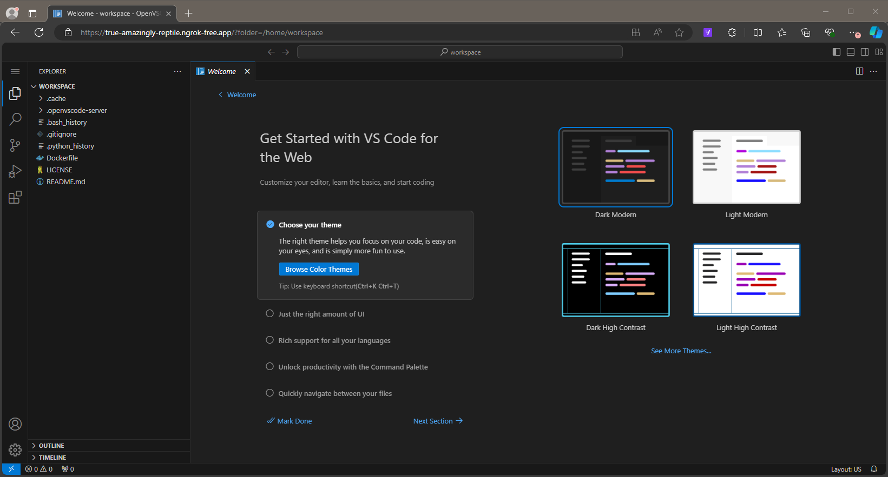

# Web-Accessible Visual Studio Code with ngrok in Docker

Docker image for VSCode (Open GitPod version), web-accessible remotely with ngrok.
This image contains Python support, but can be modified to include other languages and frameworks.

<h3 align="right">Colby T. Ford, Ph.D.</h3>

## Build Docker Image

```bash
docker build -t vscode-ngrok .
```
Note that you can also install various extensions or packages by modifying the `Dockerfile`.

## Run Docker Container

Fill in the environment variables for your ngrok account (token and domain).

```bash
docker run -it --init -e NGROK_AUTHTOKEN=1bZ0mdX1e5w0mfe8igGmHlMyriD_4azXY84YHzSt5fJbjZ5bm -e NGROK_DOMAIN=close-endlessly-grubworm.ngrok-free.app -e NGROK_PORT=3000 -p 3000:3000 -v "$(pwd):/home/workspace:cached" vscode-ngrok
```

Then, you'll be able to access your VSCode instance via the ngrok domain.

